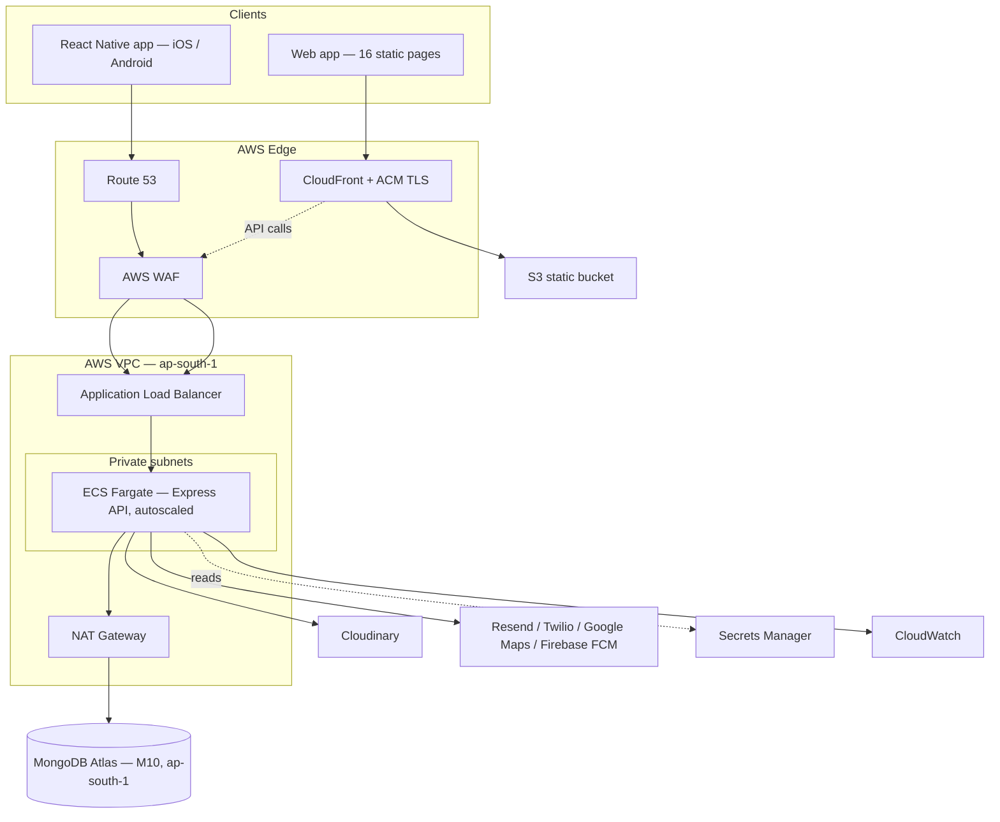

# 99 Warehousing — Platform Roadmap

**From static site to production marketplace.** This roadmap reconciles two prior planning documents into one build plan:

- `BPSF_Fullstack_Guide.docx` — an existing, code-level implementation guide: **Node.js/Express + MongoDB**, hosted on a PaaS called Antigravity.
- `Replica of 99 aces.pdf` — a vendor proposal (Nexsoftgen IT Solutions, 14 Jul 2026) for a "99acres-style" real estate portal: **ASP.NET Core + SQL Server + Kotlin Android**, hosted on Azure/AWS.

**Decision:** keep the Node/Express/MongoDB backend and React Native mobile direction already speced in the guide (working code, no rewrite). Adopt the vendor proposal's full feature ambition — RBAC, approval workflows, audit trail, admin reporting, lead management — mapped onto 99 Warehousing's actual domain (warehouses, land, brokers — not residential BHK listings). Host on **AWS**, replacing Antigravity.

---

## 1. Executive Summary

99 Warehousing is evolving from a 16-page static marketing site into a transactional marketplace for industrial real estate — warehouses, land, logistics parks, cold storage, dark stores — connecting buyers/tenants, owners/sellers, brokers, and agencies, governed by an admin approval and moderation layer.

Nothing about the current frontend gets thrown away. The 16 HTML pages refactored this session (shared `assets/site.css`, `assets/site.js`, `assets/auth.css`) become the presentation layer for a live API instead of a static mock. The backend gets built from the guide's already-written schemas and routes, extended with everything the vendor proposal calls for that the guide didn't yet cover.

## 2. Current State vs Target State

**Current:**
- 16 static HTML pages — no live data, no auth, `dashboard.html`'s role switcher is a UI mock only (four hardcoded personas, no real session).
- `BPSF_Fullstack_Guide.docx` specs, not yet implemented: Express skeleton, 4 Mongoose models (`User`, `Listing`, `Enquiry`, `Review`), JWT+OTP auth, listings/enquiries/brokers/reviews/upload/contact/insights routes, Cloudinary/Resend/Twilio/Google Maps integrations.
- No admin portal, no audit trail, no persisted favorites/compare, no CMS, no reports backend, no mobile app, no production hosting.

**Target:**
- Same 16 pages, now calling a live REST API.
- Server-enforced RBAC for buyer / owner-seller / broker / agency / admin — not just a UI mock.
- Admin governance: property approval, broker verification, CMS, reports, audit trail — built as new panels inside `dashboard.html`'s existing role-switch scaffold.
- Favorites, Compare, Site Visit scheduling, Notifications backed by the API.
- React Native mobile app mirroring the web feature set.
- Production AWS infrastructure with CI/CD, monitoring, and a hardened security perimeter.

## 3. Reconciled Technology Stack

| Layer | Decision | Rationale |
|---|---|---|
| Backend API | Node.js 20 + Express 4 | Already speced in the guide (§5–§8) — working code, no C#/.NET rewrite |
| Database | MongoDB Atlas, M10+ dedicated, `ap-south-1` | Schemas already modeled; Atlas deploys natively inside AWS regions |
| Web frontend | Existing 16 static pages | Just refactored — becomes data-driven, not rebuilt |
| Mobile | React Native (Expo) | The guide's own Phase 5 plan — reuses the same API and JS skillset instead of a separate Kotlin codebase |
| Auth | JWT access(15m)/refresh(7d) + bcrypt + OTP, hardened per §10 | Keep, harden |
| File storage | Cloudinary | Already speced, cloud-agnostic |
| Email | Resend | Already speced |
| SMS/WhatsApp | Twilio | Already speced |
| Maps | Google Maps JS API | Already speced |
| Push notifications | Firebase Cloud Messaging via Expo | Matches the vendor proposal's own notification layer exactly |
| Hosting | **AWS** (replacing Antigravity) | Your instruction — full architecture in §9 |
| Feature scope | Vendor proposal's full module list | Mapped onto 99 Warehousing's warehouse/land domain in §5 |

## 4. Target Architecture



## 5. Feature & Module Matrix

| Module | Web | Mobile | Admin | Status | 99 Warehousing page(s) |
|---|:-:|:-:|:-:|---|---|
| Auth & RBAC | ✓ | ✓ | ✓ | Extend | login.html, register.html, forgot-password.html |
| Property search (city/type/budget/grade) | ✓ | ✓ | — | Extend | warehouses.html, land-parks.html |
| Property listing (grid/list/map) | ✓ | ✓ | — | Extend | warehouses.html |
| Property details (photos/video/floor plan) | ✓ | ✓ | — | Extend | property-detail.html |
| Property upload (4-step wizard) | ✓ | ✓ | — | Extend | submit-listing.html |
| Property approval workflow | — | — | ✓ | **New** | dashboard.html (admin panel) |
| Broker directory, profile, RERA verification | ✓ | — | ✓ | Extend | brokers.html, broker-profile.html |
| Lead / enquiry pipeline | ✓ | — | ✓ | Extend | contact.html, dashboard.html |
| Favorites | ✓ | ✓ | — | **Built (local)** — persists via `assets/bpsf-store.js`; swap driver for `/api/favorites` in Phase 1 | warehouses.html |
| Compare properties | ✓ | ✓ | — | **Built (local)** — persists + real comparison table; swap driver for `/api/compare` in Phase 1 | warehouses.html |
| EMI / lease calculator | ✓ | ✓ | — | **Live already** | calculator.html, land-parks.html, property-detail.html |
| Site visit scheduling | ✓ | ✓ | — | **New** | — |
| Contact owner / WhatsApp | ✓ | ✓ | — | Extend (static number today → dynamic per-listing) | property-detail.html |
| Push notifications | — | ✓ | — | **New** (web uses email/SMS) | — |
| Market insights & reports | ✓ | — | — | Extend (hardcoded rate array → real aggregates) | insights.html |
| CMS (banners, blog, static pages) | ✓ | — | ✓ | **New** | closes dead Privacy/Terms/RERA footer links |
| User management | — | — | ✓ | **New** | — |
| Reports & analytics dashboard | — | — | ✓ | **New** | — |
| Audit trail | — | — | ✓ | **New** | — |
| Master data (cities, categories) | — | — | ✓ | **New** | — |

## 6. Data Model Additions

**Existing (guide §4, keep as-is):** `User`, `Listing`, `Enquiry`, `Review`.

**New collections:**

```
AuditLog      { actor, action, entity, entityId, before, after, ip, userAgent, createdAt }
Favorite      { user, listing, createdAt }                          — unique(user, listing)
Comparison    { user, listings[max 3], createdAt }
SiteVisit     { listing, requestedBy, proposedSlots[], confirmedSlot, status, notes }
Notification  { user, type, title, body, link, channel, read, createdAt }
CmsBanner     { title, image, link, placement, active, order }
CmsBlogPost   { title, slug, body, coverImage, author, published, publishedAt }
CmsPage       { slug, title, body }        — powers Privacy / Terms / RERA footer links
Settings      { cities[], categories[], ... }  — admin-controlled master data
```

**Extend existing:**
- `Listing` — add `approvedBy`, `approvedAt`, `rejectionReason`, `videos[]`, `slug`.
- `User` — add `lastLoginAt`, `failedLoginAttempts`, `lockedUntil`, `notificationPrefs`.

## 7. API Surface Additions

**Existing (guide §5–§8):** `/api/auth`, `/api/listings`, `/api/enquiries`, `/api/brokers`, `/api/reviews`, `/api/upload`, `/api/contact`, `/api/insights`.

**New:**
```
/api/favorites            GET / POST / DELETE
/api/compare              GET / POST / DELETE   (max 3 enforced server-side)
/api/site-visits          POST / GET mine / PATCH confirm|cancel
/api/notifications        GET mine / PATCH mark-read
/api/admin/properties     GET pending / PATCH approve|reject
/api/admin/brokers        PATCH verify
/api/admin/users          GET / PATCH role|status
/api/admin/cms/banners    CRUD
/api/admin/cms/blog       CRUD
/api/admin/cms/pages      CRUD
/api/admin/reports        GET property|leads|users|revenue  (aggregation pipelines)
/api/admin/audit          GET  (filterable)
/api/admin/settings       GET / PATCH  (cities, categories, master data)
```
All `/api/admin/*` routes sit behind a new `requireRole('admin')` middleware, layered on top of the existing `requireAuth` middleware (guide §7.1).

## 8. RBAC Permission Matrix

| Capability | Buyer | Owner/Seller | Broker | Agency | Admin |
|---|:-:|:-:|:-:|:-:|:-:|
| Browse & search listings | ✓ | ✓ | ✓ | ✓ | ✓ |
| Save favorites / compare | ✓ | ✓ | ✓ | ✓ | ✓ |
| Submit enquiry / site visit | ✓ | — | — | — | ✓ |
| Create / edit own listing | — | ✓ | assigned | ✓ | any |
| Submit listing for approval | — | ✓ | ✓ | ✓ | — |
| Approve / reject listing | — | — | — | — | ✓ |
| View own listing's leads | — | ✓ | ✓ | ✓ | ✓ |
| Reassign lead to broker | — | — | — | ✓ | ✓ |
| Request broker verification | — | — | ✓ | ✓ | — |
| Approve broker verification | — | — | — | — | ✓ |
| Manage CMS content | — | — | — | — | ✓ |
| View reports/analytics | — | own | own | own | all |
| Manage users/roles | — | — | — | — | ✓ |
| View audit trail | — | — | — | — | ✓ |

## 9. AWS Hosting Architecture

- **Compute** — ECS Fargate running the existing Express app as a container, 2 tasks minimum across 2 AZs, autoscale 2→6 on CPU>60% or request count, behind an ALB target group.
- **Edge** — CloudFront in front of the ALB for the API; a separate CloudFront distribution for the S3-hosted static frontend, mirroring the guide's own `antigravity.yaml` two-service split.
- **Networking** — one VPC; public subnets hold the ALB and NAT Gateway; private subnets hold the ECS tasks. NAT Gateway carries ECS's outbound calls to MongoDB Atlas / Cloudinary / Resend / Twilio / Google / Firebase.
- **Database** — MongoDB Atlas M10 in `ap-south-1`, kept as-is. Restrict Atlas Network Access to the NAT Gateway's Elastic IP only — direct translation of the guide's own instruction to "restrict to Antigravity's static IP in production."
- **Static hosting** — private S3 bucket behind CloudFront (Origin Access Control). Keep `.html` extensions in links for v1; add a CloudFront Function for pretty URLs (`/warehouses` → `warehouses.html`) as a fast-follow.
- **DNS/SSL** — Route 53 hosted zone; ACM certificates (`us-east-1` for CloudFront, `ap-south-1` for the ALB), auto-renewed.
- **Secrets** — AWS Secrets Manager holds the same variable set as the guide's `.env` (`MONGO_URI`, JWT secrets, Cloudinary/Resend/Twilio/Google keys). ECS injects them at runtime — never baked into the image.
- **CI/CD** — GitHub Actions. Push to `develop`: build+test, push image to ECR, deploy to staging ECS, sync frontend to staging S3. Push to `main` (after PR approval): same pipeline against production, with a manual approval gate before the ECS deploy step. Zero-downtime via ECS rolling deployment.
- **Monitoring** — CloudWatch Logs for ECS stdout; Alarms on 5xx rate / CPU / memory / task count; SNS to email/Slack on trip. AWS Budgets alert at a set monthly threshold.
- **Environments** — dev (local, guide §2), staging (AWS, 1 task), production (AWS, autoscaled, Multi-AZ Atlas).

## 10. Security Architecture

Builds on what the guide's `app.js` already has (`helmet`, `cors`, `morgan`, rate limiting) and hardens it:

- **AuthN** — keep JWT access(15m)/refresh(7d) + bcrypt(cost 12) + OTP. Harden: move the refresh token from the JSON response body into an `httpOnly` + `Secure` + `SameSite=Strict` cookie (removes it from XSS-reachable storage); add lockout after 5 failed logins in 15 minutes using the new `failedLoginAttempts`/`lockedUntil` fields; add optional TOTP MFA gated to the `admin` role only.
- **AuthZ** — every mutating route gets `requireAuth` (exists) plus new `requireRole(...)` and `requireOwnership(resourceLoader)` middleware, so a broker can only edit assigned listings, an owner only their own, admin any — enforced server-side, not just hidden in the UI.
- **Input validation** — `express-validator` schemas on every new POST/PATCH body; reject unknown fields to block mass-assignment into fields like `role` or `isVerified`.
- **Injection** — Mongoose parameterizes queries by default; add `express-mongo-sanitize` to strip NoSQL operators (`$where`, `$gt`, …) from user-supplied query params/body.
- **XSS** — tighten Helmet's CSP to an explicit allow-list (Google Maps, Cloudinary, own API origin only); sanitize all rendered user content (broker bios, CMS blog body) server-side with `sanitize-html` before storage.
- **CSRF** — not applicable to bearer-token calls; once the refresh token moves to a cookie, add a double-submit CSRF token check on `/api/auth/refresh`, the one cookie-authenticated endpoint.
- **File uploads** — enforce MIME allow-list + size cap in the existing `multer` config (guide §8.2); run uploads through Cloudinary's moderation add-on before they go public.
- **Rate limiting** — keep the guide's global 200 req/15min; add a stricter 5 req/15min limiter scoped to `/api/auth/login` and `/api/auth/register`.
- **Encryption** — TLS 1.2+ everywhere (ACM certs on CloudFront/ALB); Atlas encryption-at-rest (default) plus client-side field-level encryption for `brokerDetails.reraNumber` and any future government-ID fields; assets served over HTTPS only.
- **Secrets** — AWS Secrets Manager (§9), rotated on a schedule for JWT secrets; `git-secrets` scan in CI to keep them out of the repo (the guide already says never commit `.env` — this enforces it).
- **Audit trail** — the new `AuditLog` collection (§6), written by one middleware hooked onto every admin mutation route — actor, before/after diff, IP, timestamp. Satisfies the vendor proposal's explicit audit-trail requirement and gives you incident forensics.
- **Dependency hygiene** — `npm audit` + Dependabot on every PR; ECR image scanning on push; block merge on critical/high CVEs.
- **Compliance** — India's Digital Personal Data Protection Act 2023: collect only necessary PII, publish a privacy policy (CMS static page), support a data export/delete request flow, log consent for marketing communications.
- **Backup & DR** — Atlas continuous backups with point-in-time recovery, RPO target ≤ 1 hour, quarterly restore test; RTO target ≤ 4 hours for the API tier via ECS redeploy from the last known-good image.
- **Pre-launch** — a scoped penetration test (auth bypass, IDOR on listing/enquiry IDs, upload abuse, rate-limit bypass) before the DNS cutover in Phase 7.

## 11. Delivery Roadmap

| Phase | Weeks | Focus | Key deliverables | Status |
|---|---|---|---|---|
| 0 — Foundation | — | Static frontend refactor + backend/infra specs authored | 16-page site, shared assets, this roadmap | **Done** |
| 0.5 — UI + local features | — | Hero redesign to the approved wireframe, matte-glass navbar, first two spec features shipped client-side | New hero (slogan / stats / 3 featured cards), performance-tuned navbar, `assets/bpsf-store.js` with persisted Favourites + Compare and a data-driven comparison table | **Done** |
| 1 — Backend bring-up | 1–2 | Scaffold per guide §2–§8 | Auth/listings/enquiries/brokers/reviews live in dev, Postman collection green | Planned |
| 2 — RBAC, approval & admin core | 3–4 | Server-enforced authorization | `requireRole`/`requireOwnership`, listing approval + admin panel, broker verification, AuditLog wired | Planned |
| 3 — Engagement features | 5–6 | Favorites, compare, visits, leads | Favorites/Compare APIs, SiteVisit scheduling, dynamic WhatsApp links, Notification delivery | Planned |
| 4 — CMS, reports & analytics | 7–8 | Admin content & insight | CMS models + UI (closes dead footer links), report exports, insights.html on real data | Planned |
| 5 — AWS infra & hardening | 7–9 (parallel) | Production environment | VPC/ECS/ALB/CloudFront/S3/Route53/WAF/Secrets Manager live, CI/CD green, §10 checklist done | Planned |
| 6 — React Native app | 6–10 (parallel) | Mobile parity | Expo app: search/detail/contact/favorites/compare/EMI calc, FCM push | Planned |
| 7 — Integration, UAT & go-live | 11–12 | Launch | Regression + load test, UAT sign-off, pen test, DNS cutover, monitoring live | Planned |
| 8 — Post-launch | Month 4+ | Warranty & growth | 3-month bug-fix window, optional AMC, then Atlas Search / Razorpay / PostHog / demand heatmap (guide's own Phase 2–5) | Planned |

**~12 weeks to production go-live** (mobile finishes in the same window, running parallel from week 6) — in the same range as the vendor proposal's own 12–14 week estimate, despite the reconciled stack being lighter to build than the ASP.NET Core/Kotlin path.

## 12. Testing Strategy

- **Unit** — Jest for model methods (password hashing, JWT signing) and pure utilities.
- **Integration** — supertest against `mongodb-memory-server` for every route in §7.
- **E2E/UAT** — Playwright, extending the guide's own "Post-Deploy Checklist" flow (register→OTP→login→submit listing→admin approve→live→enquiry→email) with favorite, compare, site visit, admin CMS edit, report export.
- **Load** — k6/Artillery against staging: homepage TTFB < 300ms, listing search API p95 < 400ms at 50 concurrent users.
- **Security** — `npm audit`/Dependabot continuously; scoped pen test before go-live (§10).
- **Mobile** — Expo EAS build + manual testing on 2 Android + 1 iOS reference device before store submission.

## 13. Team & Roles

| Role | Owns |
|---|---|
| Backend engineer (Node/Express/MongoDB) | §6, §7, §10 |
| Frontend engineer | Wiring the 16 static pages to the live API |
| Mobile engineer (React Native/Expo) | §11 Phase 6 — can double with frontend given the shared JS stack |
| DevOps/Cloud (part-time) | §9 AWS infra + CI/CD — can double with backend for a small team |
| QA (part-time from Phase 2) | §12 |
| Product owner (you) | Approvals, UAT sign-off, master data |

## 14. Cost Model

**A. One-time build effort** (engineer-weeks, self-built — no vendor quote applies): Backend core 2w · RBAC/Admin 2w · Engagement features 2w · CMS/Reports 2w · AWS infra 2w (parallel) · Mobile app 4–5w (parallel) · Testing/UAT/go-live 2w ≈ **12 weeks elapsed** with 2–3 people running parallel tracks.

**B. Monthly run-rate once live:**

| Line | Est. monthly (USD) |
|---|---|
| ECS Fargate (2–4 tasks) | $30–70 |
| Application Load Balancer | $20 + data |
| NAT Gateway | $32 + data *(biggest surprise line item — see §15)* |
| S3 + CloudFront | $5–20 |
| Route 53 | ~$1 |
| Secrets Manager | ~$2 |
| CloudWatch | $5–10 |
| AWS WAF | $5–10 |
| MongoDB Atlas M10 (ap-south-1) | $60–70 |
| Cloudinary (paid tier) | $0–89 |
| Resend | $0–20 |
| Twilio (pay-as-you-go) | $20–50 |
| Google Maps (pay-as-you-go, $200 free credit) | ~$0 at launch scale |
| **Total** | **≈ $180–290/mo (₹15,000–24,000/mo)** |

For reference, the vendor proposal's own quoted Annual Recurring Cost was ₹1,73,750/year (≈₹14,500/month) for AMC + hosting + support — in the same ballpark — but here you own the code and infrastructure outright, with no vendor lock-in and no separate ₹8,25,000 one-time development fee.

## 15. Risks & Mitigations

| Risk | Mitigation |
|---|---|
| NAT Gateway data costs balloon at scale | Add VPC endpoints for S3/Secrets Manager traffic to keep it off the NAT path |
| MongoDB Atlas ↔ AWS cross-network latency | Confirm Atlas cluster and ECS tasks share `ap-south-1`, or use Atlas's AWS PrivateLink |
| Small team stretched across backend + infra + mobile | Phase 6 (mobile) can slip a sprint without blocking Phase 7 web go-live — it's an independent parallel track |
| Admin panel scope creep (CMS + reports + audit in one phase) | Ship property approval + audit trail first (Phase 2, launch-blocking); treat CMS/reports as fast-follow if the timeline tightens |
| Third-party SaaS costs scale with usage, not fixed | Set spend alerts on each vendor's own dashboard (Twilio, Cloudinary) in addition to AWS Budgets |

## 16. Go-Live Checklist

Extends the guide's existing Post-Deploy Checklist (Authentication / Listings / Performance / Mobile):

- [ ] RBAC — a buyer account cannot `PATCH` another user's listing (expect 403)
- [ ] Approval — a pending listing is invisible on `/warehouses` until admin-approved
- [ ] Audit — an approval action writes an `AuditLog` entry with correct actor/before/after
- [ ] Favorites/Compare — both persist across a logout/login cycle
- [ ] Site visit — scheduling a visit notifies the listing owner
- [ ] CMS — Privacy/Terms/RERA footer links resolve to real published pages
- [ ] Reports — an admin report export downloads a valid Excel/PDF file
- [ ] Security — rate limiting trips on the login endpoint after 5 attempts in 15 min
- [ ] Security — pen test findings are closed or formally risk-accepted
- [ ] DR — a MongoDB Atlas point-in-time restore succeeds in staging
- [ ] Mobile — push notification delivery confirmed on a real Android + iOS device
- [ ] DNS — zero-downtime cutover confirmed during the propagation window

---
*Sources: `BPSF_Fullstack_Guide.docx` v1.0 (2025); `Replica of 99 aces.pdf`, Nexsoftgen IT Solutions & Services, 14-Jul-2026.*
